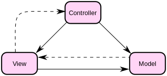

# Delphi MVCBr

**MVCBr** é um framework MVC (Model-View-Controller) para Delphi que implementa o padrão de arquitetura de software separando a representação da informação da interação do usuário. Inclui suporte completo a **OData**, integração com VCL, FMX e UniGUI, além de diversos padrões de design como Builder, Facade, Factory, Singleton, Mediator, Observer, Adapter, Decorator, Composite, Strategy, Prototype e Lazy Loading.



---

## Funcionalidades

- Framework MVC completo para VCL, FMX e UniGUI
- Servidor e cliente **OData** (ODataBrServer) com suporte a múltiplos bancos de dados (Firebird, MySQL, MSSQL, Oracle, PostgreSQL)
- Integração com FireDAC e MongoDB
- IDE Expert / Wizards para RAD Studio
- Padrões de projeto implementados: Builder, Facade, Factory, Singleton, Mediator, Memento, Observer, Adapter, Decorator, Composite, Strategy, States, Prototype, Lazy
- Servidor OData nos modos: aplicação Windows, Windows Service, ISAPI DLL e Linux
- Gerador de metadados
- Diversos exemplos práticos (VCL, FMX, OData, jQuery)

---

## Pré-requisitos

- Delphi **Seattle** (10), **Berlin** (10.1) ou **Tokyo** (10.2)
- FireDAC (nativo do Delphi)

---

## Instalação

### Via IDE (pacote)

Abra o arquivo de grupo de projeto correspondente à sua versão do Delphi e compile:

| Versão Delphi | Arquivo |
|---|---|
| Seattle (10) | `package/MVCBrPackageSeattle.groupproj` |
| Berlin (10.1) | `package/MVCBrPackageBerlin.groupproj` (necessita update 2) |
| Tokyo (10.2) | `package/MVCBrPackageTokyo.groupproj` |

Após compilar, o framework estará disponível em: **New → Other → MVCBr → MVCBr Project**.

### Via instalador

Execute o `MVCBrInstall.exe` para instalação automatizada.

### Configuração

Adicione o caminho da pasta raiz `\MVCBr` no *Library Path* do Delphi.

---

## Estrutura do Projeto

```
MVCBr/
├── package/         # Pacotes Delphi, IDE experts, tests, templates
├── VCL/             # Componentes VCL (OData adapters, HTTP client, FireDAC)
├── FMX/             # Componentes FMX (PageView, LayoutView)
├── oData/           # Engine OData: parser, SQL, dialects, client, JSON
├── MVCBrServer/     # Servidor OData (Windows, Service, ISAPI, Linux)
├── DMVC/            # DMVC Framework (bundled, Apache 2.0)
├── Exemplos/        # Exemplos: vcl/, fmx/, oData/, jQuery/
├── UniGui/          # Integração UniGUI
├── MongoWire/       # Driver MongoDB (MIT)
├── Docs/            # Documentação HTML (pasdoc)
├── templates/       # Templates de geração de código
└── bin/             # Binários compilados
```

---

## OData

O MVCBr possui uma implementação completa do protocolo OData, incluindo:

- **Servidor OData** (`MVCBrServer/ODataBrServer.dpr`) nos modos: aplicação, Windows Service, ISAPI e Linux
- **Cliente OData** com suporte a `$filter`, `$top`, `$skip`, `$orderby` e operações CRUD
- **Dialetos** para Firebird, MySQL, MSSQL, Oracle e PostgreSQL
- **Componentes VCL**: TODataDatasetAdapter, TODataDatasetBuilder, TODataFDMemTable
- **Exemplos** em `Exemplos/oData/`

---

## Links

- [Como usar MVCBr](http://bit.ly/2l7w5tG)
- [YouTube: Início do projeto](http://bit.ly/2gyBpVp)
- [Blog Tire de Letra](http://bit.ly/2yQVQnT)
- [Facebook](http://bit.ly/2iruz4s)

---

## Créditos

| Nome | Contribuição |
|---|---|
| Kleberson Toro | Fundador e idealizador |
| Amarildo Lacerda | Fundador e implementação (coder) |
| Oteniel Furquim | Debates e definição |
| Ivan Cesar | Debates e implementação do MemDataset para OData |
| Elizangela Borato | Driver Postgres para OData e gerador de metadados |
| Thulio Bittencourt | Definição de escopo |
| Juliomar Marchetti | Instalador e inclusão no GETIT |
| Regys Borges da Silveira | Controle de versão e instalador |
| Mauricio Abreu / Leonardo | Questionamento |
| Carlos Dias (Dex) | Testes, usercase, ícones dos experts |
| Giovani Da Cruz | Servidor OData como serviço |

Plataforma de divulgação: [tireideletra.com.br](http://tireideletra.com.br) (Apoio: WBAGestão-Storeware)

---

## Licença

Distribuído sob **Apache License 2.0** (consulte os cabeçalhos dos arquivos fonte).

Componentes de terceiros incluídos:
- **DMVC** — Apache License 2.0
- **LoggerPro** — MIT License
- **MongoWire** — MIT License
